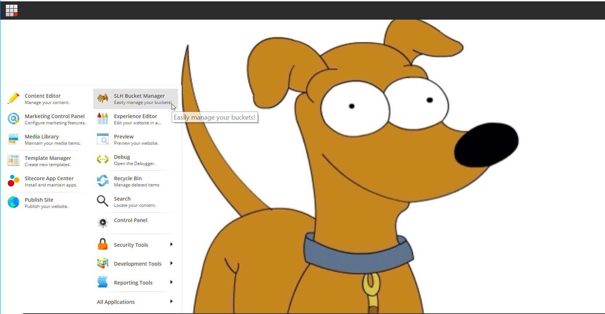

# SLH Bucket Manager

## Summary

**Category:** Best enhancement to the Sitecore Admin (XP) UI for Content Editors & Marketers

This administrator tool will allow content authors and administrators to easily manage their current items hosted inside a bucket folter. 
As you might know, sometimes it's hard to visualize content items that live under bucket folders and as a content manager you usually use the search in order to find a specific item, but what if these bucketable items are shown in a friendly interface where you can see exactly which items are bucket folder and its children.

## Pre-requisites

Please make sure you have the following requirements installed:

- Sitecore 9.1.0 rev. 001564 (Initial Release)

## Installation

Please follow this instructions to install this module:

1. Use the Sitecore Installation wizard to install the [package](resources/SLH Bucket Manager.zip)
2. Publish site (smart mode)

For more details, read our [Installation Guide](Installation_Guide.md)

### Enable the Feature on your existing site

1. Open Sitecore Desktop from the LaunchPad
2. Click on the start up menu and you will see a new application
3. Select that application and a window will come up and it's ready to be used

## Configuration

You don't need to configure anything else, the module is ready to be used once it's correctly installed.
No file configurations are needed. 

## Usage

Go to Start up menu and Select "SLH Bucket Manager" on the top right menu.

This is the view you will see when the module comes up. Here you will see all the bucket folders separated by tabs and inside each tab you will be able to see its children, a bucketable item. 

[Manager](images/Manager.png)

in this view, you will notice that you can publich an item. Just click on the Publish link and it will trigger the publish manager to do it for you. 

[Publish](images/Publish.png)

In this view, you have the abiltity to edit directly the item. You don't need to go to the content author or the experience editor. 

[Edit](images/Edit.png)

It shows only the template fields that belong to that specific template, that means it hides all the standard template fields. 

[BaseTemplates](images/BaseTemplates.png)

If you have a field, different than a single text, it will also show the item name, for instance the items thar are link item such as Droplink, treelist, etc.

[LinkField](images/LinkField.png)

It also handles pagination, every 10 items it will create a new page. For future reales we are planning to make it dynamic so the administrator can set this number. 

[Pagination](images/Pagination.png)

NOTE; For future releases we are planning to make it work with workflows and add the ability to publish all edited item with just one click. Stay tuned!

### Content Editor

No integration with Content Editor. We are planing to create an Editor tab to hanlde bucketable items within the content editor. 

### Experience Editor

No experience editor feature available.

## Video

Here is our presentation of this module. 

[direct link](resources/Sitecore Hackathon 2019.mp4) to the video, 

Youtube:

